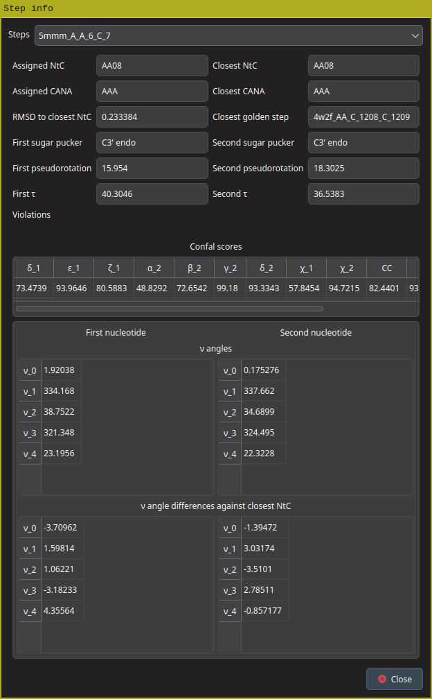
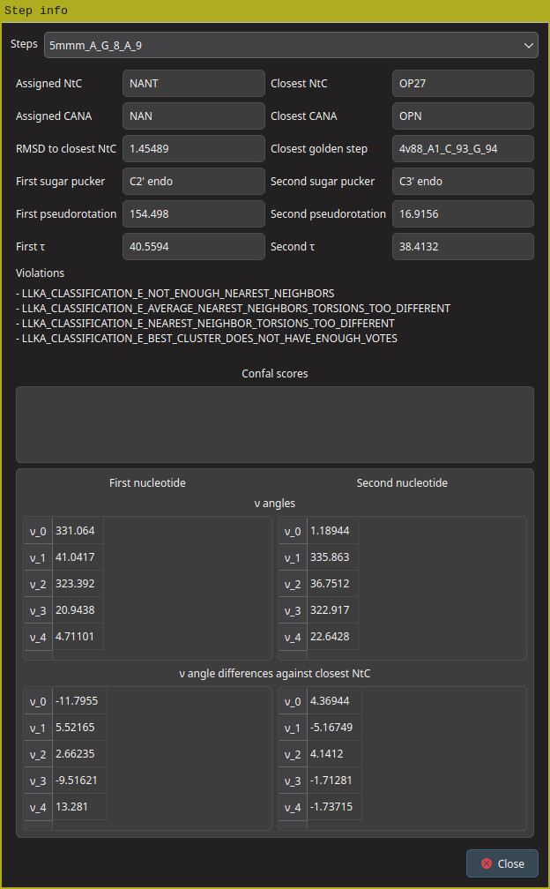

GUI assigner
===

This is a more advanced example of how to use the (Re)DNATCO nucleic acid processing library. The example is a fully functional GUI application that performs interactive NtC assigment. The example demonstrates the use of the C++ API wrapper.

Requirements
---

This example uses Qt 6 to create the GUI. To build this example, Qt 6 development environment must be available on your machine.

Usage
---

The window of the `gui_assigner` program is shown below.[^1]

To run NtC assignment, you first need to point the `gui_assigner` to a directory with the [assignment parametrization files](../../README.md#NtC-assignment-parametrization). Enter the path to the directory where these files are located into the `Path to directory with parameters files` into the field or use the `Browse` button.

Next pick a file with the structure to analyze. Mind that `gui_assigner` can only process mmCIF files.

Once the assignment is complete, a table with the list of __dinucleotide steps__ is displayed. The table lists the assigned _CANA_ and _NtC_ classes, the _Confal score_ and the _Root mean square distance_ from the geometry of the reference __dinucleotide step__.[^2]

Double-clicking on a step in the table displays additional details about the assigned __dinucleotide step__.

If a __dinucleotide step__ cannot be assigned, the detail view will display a list of reasons why the assignment process refused to assign a __NtC__/__CANA__ class to the step.

[^1]: Note that appearance of some graphical elements may vary with your operating system and environment configuration
[^2]: For more details about the assignment process refer to the respective papers
